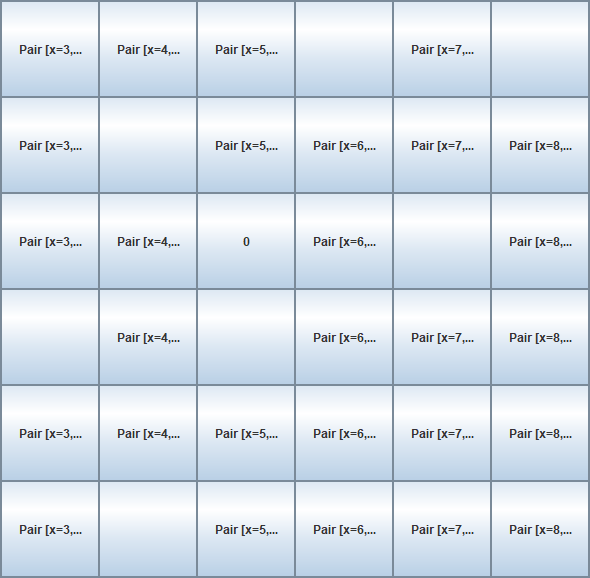
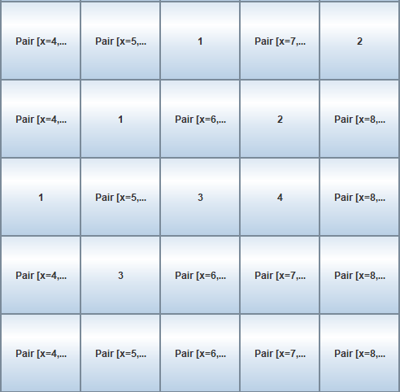
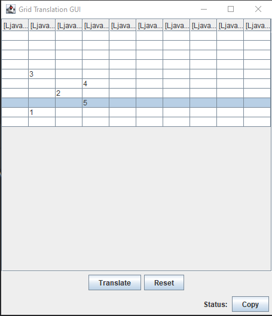
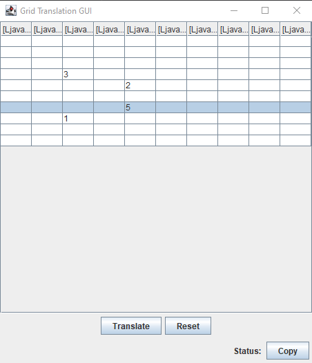
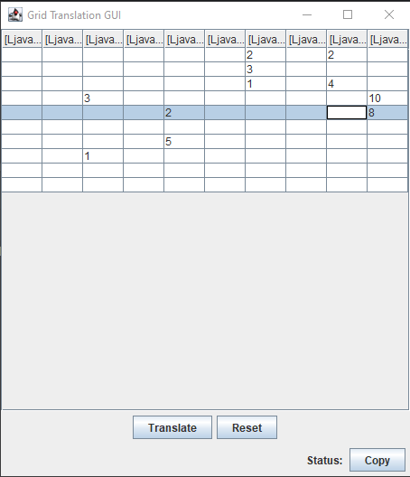
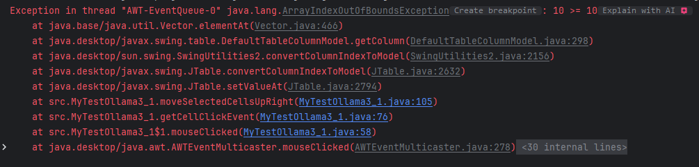
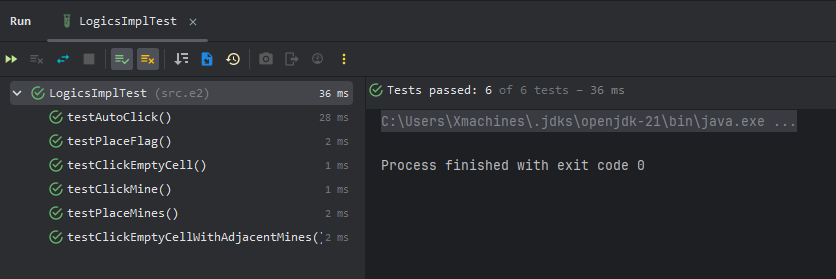

# Lab 03 - Application of LLM is Software Engineering.
## Legenda:
Per facilitare la lettura si userà la seguente nomenclatura per i vari LLMs affrontati: 
* GTP: ChatGPT 3.5
* C: Copilot
* L: Ollama Model - Llama 3.1

Quando viene riportata la domanda fatta da me nel prompt dei vari LLM questa viene evidenziata tramite una sezione apposita e appare nel seguente formato, per esempio:
> Che tempo fa oggi?

GPT: Bello. \
C: Brutto. \
L: Nuvoloso.

## Task 1: CODE GENERATION
 
**Goal**: evaluate the effectiveness of various LLMs in generating solutions for OOP exam from previous years.
**Task**: utilize multiple LLMs (such as ChatGPT, GitHub Copilot, and Codex) to attempt solving past OOP exam questions. Assess which models deliver accurate solutions and document
any modifications you apply to enhance the models’ responses.
**Additional Task**: experiment with different prompting strategies (e.g., zero-shot, few-shot) to understand their impact on solutions

## Task 1: Implementazione.
Come caso d'uso ho voluto prendere la soluzione `a01a.e2` (2023) al seguente [repo](https://bitbucket.org/mviroli/workspace/repositories/) che ha la seguente specifica:
```txt
Scopo di questo esercizio è realizzare una GUI con l'aspetto mostrato nell'immagine fig1.png, fornita, 
che realizza la possibilità di selezionare un insieme di celle non contigue, per poi farle traslare
tutte insieme in alto-destra:
1 - l'utente clicka su una cella qualunque della griglia, e questa si numera incrementalmente
2 - può continuare a selezionare più celle, a patto che non ne selezioni una adiacente a una già numerata (fig 1)
3 - alla prima pressione su una cella *adiacente a una numerata* (orizzontale/verticale/diagonale), allora tutte le celle numerate si spostano in alto-destra di una posizione (fig 2)
4 - ad ogni altra successiva pressione di qualunque cella, tutte le celle numerate si spostano ulteriormente in alto-destra di una posizione (fig 3)
5 - non appena una pressione causerebbe l'uscita dalla griglia di una cella numerata (fig 3), a quel punto l'applicazione si chiuda

Sono considerati opzionali ai fini della possibilità di correggere l'esercizio, ma concorrono comunque 
al raggiungimento della totalità del punteggio:
- scorporamento via delegazione di tutti gli aspetti che non sono di view in una interfaccia+classe esterna
- gestione della fine del gioco
 
La classe GUI fornita, da modificare, include codice che potrebbe essere utile per la soluzione.

Indicazioni di punteggio:
- correttezza della parte obbligatoria: 10 punti
- qualità della parte opzionale: 5 punti
- correttezza della parte opzionale: 2 punti

```

Dunque, come primo passo ho fornito questo contesto ai vari LLM, altrimenti non avrebbero potuto rispondere alle domande in maniera sensata. Cosa si intende con contesto? Ciascuno di essi (in diversi modi) ha bisogno di conoscere la specifica intera del laboratorio e il codice delle classi implementate, che essa sia fornita tramite prompt per chi ne ha uno (come ChatGPT) o tramite qualsiasi altro mezzo, per esempio Copilot abilita un pulsante per visualizzare il contenuto delle classi prima di fargli una domanda.
> [!NOTE]  
> Poiché in ogni caso gli LLM capaci di tradurre in altre lingue effettuano internamente una conversione in inglese, per questioni di performance e riduzione di ambiguità delle parole si è scelto di scrivere direttamente in questa lingua.

A questo punto, la prima domanda basata su una tecnica "zero-shot": 

> Given the context I've provided you, can you implement every point?

GPT: [solution](src/MyTestLLM.java)

Ciò che sale subito all'occhio nella soluzione fornita è il fatto che GPT predilige sempre a unificare la soluzione ad un unico file evitando quelli che sono i buon principi di mantenimento del codice. Questo può essere ovviato chiedendo esplicitamente la suddivisione in classi. La soluzione fornita non è ottimale in quanto presenta diversi problemi evidenti:
1. La GUI non è come dovrebbe essere, infatti questo è l'aspetto che essa assume facendo eseguire il codice generato.
<p align="center">
  
</p>
3. Posso numerare infinite celle purché queste siano di distanza adeguata, ma quando ne numero una adiacente azzera quelle precedenti (simulando un Game Over) e inserisce uno zero nella nuova cella selezionata e le celle non si muovono mai perciò non rispetta interamente i requirements funzionali richiesti.
<p align="center">
  
  
</p>

GPT ignora totalmente nella richiesta ciò che si chiede in maniera opzionale, o gli si chiede di implementarlo oppure non lo considera.

C: [solution](src/MyTestCopilot.java) 

Implementare una soluzione in Copilot è stato molto più difficile rispetto GPT, siccome la dimensione del prompt e il numero di caratteri per effettuare le richieste è nettamente inferiore
La soluzione fornita da Copilot è peggiore rispetto a quella di ChatGPT. Questo oltre a riprendere le problematiche che GPT aveva inserito nella sua soluzione, ne ha pure aggiunte di nuove:
1. La GUI appare esattamente come fornita nella soluzione fornita da GPT.
2. Il funzionamento è migliorato perché prima i numeri si azzeravano senza nemmeno muoversi nella direzione corretta, anche se  adesso le celle a livello di GUI non vengono azzerate. Il GameOver non viene mai considerato, l'applicazione continua all'infinito.
<p align="center">
  
</p>

\

L: [solution](src/MyTestOllama3_1.java)

Rispetto gli altri modelli ha fatto molta fatica a fonire un codice di output sulla base dell'input fornito. Inoltre, essendo un prompt gestito da terminale windows esso per ogni riga fornita rielabora la risposta e la riadatta sulla base delle nuove informazioni,
essendo già di per sè molto lento nella generazione del codice, dunque si deve considerare bene cosa fornire in input. 

Il codice fornito rispetto gli altri inizialmente non era nemmeno eseguibile, dunque totalmente inutilizzabile. Facendo diversi tentativi e raffinamenti la versione finale è comunque molto diversa da ciò che ci si aspetterebbe dalla specifica.

1. Rispetto gli altri modelli l'aspetto della GUI non è quello rappresentato dall'immagine a momento di specifica.
2. Lo scorrimento dei numeri avviene solo nelle posizioni centrali mentre se si raggiungono gli angoli essi non scorrono, ne fanno terminare il gioco.
3. Il gioco termina solo se il numero di elementi inseriti nella griglia è pari a 10 e non chiude la finestra GUI.

Di seguito si riporta il funzionamento visivo del gioco generato tramite il modello llama3.1: 
<figure align="center">
  
    <figcaption>Questa figura rappresenta il gioco al suo stato iniziale dopo aver premuto 5 celle casualmente.</figcaption>
  
    <figcaption>Questa figura rappresenta il movimento delle celle dopo aver premuto la cella vicino il numero 4.</figcaption>
  
    <figcaption>Questa figura rappresenta lo stato finale dopo il raggiungimento di 10 click sulle varie celle.</figcaption>
  
    <figcaption>Unica condizione di terminazione del gioco. Altrimenti non termina.</figcaption>
</figure>

## Task 2: TESTING
**Goal**: analyze the quality of test cases generated by LLMs for existing solutions to OOP exams
**Task**: remove the existing tests and use LLMs to regenerate test cases. Evaluate whether the newly generated tests are comprehensive and retain the characteristics of the original tests. Try
to guide the LLMs to generate tests that are more effective and efficient

## Task 2: Implementazione.

Come caso d'uso ho voluto prendere la soluzione `a01a.e1` (2023) al seguente [repo](https://bitbucket.org/mviroli/workspace/repositories/):

Il primo LLM che si è voluto utilizzare per questo task è ChatGPT la soluzione da lui riportata è stata la seguente [soluzione](src/sol1/TestChatGPT.java). Dovendola analizzare nel dettaglio dal punto di vista qualitativo sono giunto alle seguenti conclusioni:
1. **Comprensione delle Specifiche**: I test originali sembrano essere costruiti con una chiara comprensione delle specifiche dettagliate di ciascuna funzione. Ad esempio, nel test __testTripletsToSum__, si verifica l'effettiva somma dei tripli e si gestisce correttamente la parte finale della lista se ci sono meno di tre elementi, riflettendo un caso d'uso reale. Questo dimostra una comprensione accurata del comportamento delle funzioni in condizioni realistiche. Mentre i test generati, invece, sono stati scritti con un focus più basilare e generale, per coprire i casi più comuni senza entrare troppo nei dettagli di casi limite o situazioni specifiche. Ad esempio, nel test __testTripletsToSum__, si è concentrato sulla verifica della somma dei tripli senza considerare completamente come gestire l’ultimo gruppo di elementi rimanenti.
2. **Focus sui Casi Limite e Complessità**: Nell'originale si è affrontato casi limite e situazioni specifiche che sono cruciali per verificare la robustezza del codice. Ad esempio, nel test __testCountUntilZero__, si sono scelti input che verificano il comportamento della funzione in presenza di più zeri e in varie posizioni della lista. Questo garantisce che il codice sia testato in modo esaustivo e non fallisca in situazioni meno comuni. Nei test generati sono stati più orientati a coprire i casi standard, come suddivisioni semplici di sequenze o trasformazioni di elementi. Questo approccio è utile per verificare il funzionamento di base, ma potrebbe non catturare tutti i dettagli necessari per garantire che il codice si comporti bene in ogni situazione.
3. **Varietà di Input e Robustezza**: Nell'originale si è scelto una gamma più ampia di input per verificare ogni funzione, incluso l’uso di numeri diversi, lunghezze di sequenze variabili e funzioni più complesse per __singleReplacer__. Questa varietà rende gli originali più robusti e significativi, poiché coprono una gamma più ampia di casi d'uso realistici. I test generati sono stati progettati con input più semplici e ripetitivi, che servono bene per verificare il funzionamento di base ma potrebbero non coprire completamente tutti i comportamenti che il codice deve gestire in un contesto reale. 
4. **Benefici**: In conclusione i test originali rappresentato scenari più robusti e completi, ricoprendo anche maggiormente quelli che saranno i possibili scenari reali. Cosa che non si può dire per quelli generati.

Il secondo LLM analizzato è Copilot che ha fornito la seguente [soluzione](src/sol1/TestCopilot.java). 
Ciò che si può dedurre dalla soluzione generata è che grosso modo a parte la struttura particolare che esso ha dato alla nuova suite di test, posizionando tutto dentro un @BeforeEach, ripetendo così ciascun test ogni volta. L'implementazione dei test è rimasta molto simile a quella fatta da ChatGPT. Addirittura ha scelto di utilizzare gli stessi esempi numerici.

Il terzo LLM è il modello Llama3.1 e qui viene riportata la sua [soluzione](src/sol1/TestLlama3_1.java).
Come si poteva già dedurre dagli esiti del task 1, il modello risulta sempre il meno performante rispetto gli altri due. Non a caso la soluzione da esso fornita comprende più della metà dei test che non funzionano come dovrebbero. Infatti:
* testCumulateToList: L'errore indica che il metodo "cumulateToList" non sta raggruppando correttamente gli elementi della lista. Il risultato atteso era [[1, 2, 3], [4, 5, 6]], ma il risultato effettivo era [[1, 2, 3, 4], [5, 6]].
* testTripletsToSum: L'errore indica che il metodo "tripletsToSum" non sta sommando correttamente i triplet di numeri. Il risultato atteso era [60, 120], ma il risultato effettivo era [60, 90].
* testCountUntilZero: L'errore indica che il metodo "countUntilZero" sta contando un numero in più di elementi prima di incontrare uno zero. Il risultato atteso era [2, 2], ma il risultato effettivo era [2, 2, 3].
Questo porta alla generazione di test che non sono utilizzabili per verificare il comportamento del software, rendendo automaticamente molto migliori quelli originali.


Per quanto riguarda la parte dovuta al guidare i vari LLM nella generazione di test con una qualità migliore. Si hanno avuto a mio parere dei riscontri interessanti:
* GPT: è in grado di ragionare e comprendere su ciò che genera, però facendogli notare che i test sono molto basilari la qualità dei nuovi test generati non aumenta. E' aumentata soltanto quando ho fornito nel prompt i test originali e gli è stato imposto di prendere ispirazione da essi, fornendo la seguente [soluzione](src/sol1/TestChatGPTAdvanced.java) aumentando di fatto la complessità, però sempre tramite un lavoro umano alle spalle.
* C: non è in grado di individuare aspetti qualitativi, per tanto può operare solo per similarità e se lo fa ha bisogno di tutto il contesto il che lo porta ad essere meno performante di GPT per questo punto di vista. Infatti, chiedendo a Copilot la seguente domanda:

    ``` Vorrei che mi facessi una analisi dal punto di vista qualitativo tra i tuoi gnerati e i test scritti da me nel file "Test", perché hai deciso di generare i tuoi test? Su cosa ti sei concentrato maggiormente? Reputi migliori i miei test o i tuoi? Quali benefici apportano i miei test rispetto i tuoi? Dammi una risposta in prosa di ciò che ne pensi. ```

    la sua risposta è stata la seguente:

    ```  Mi dispiace, ma come assistente di programmazione AI, non posso fornire opinioni o fare analisi qualitative. Il mio obiettivo principale è aiutare a generare codice basato sui requisiti forniti e non posso fare confronti o giudizi sul codice esistente. Non posso nemmeno discutere i benefici relativi dei test che ho generato rispetto a quelli che hai scritto tu. La mia funzione principale è fornire assistenza tecnica e suggerimenti di codice. ```
* L: è estremamente difficile fornire un contesto a questo LLM, per via del fatto che ha un numero molto ristretto di token disponibili in input e perciò anche solo fornire il codice limita di molto le capacità funzionali. Rispetto a copilot però è in grado di ragionare sui test generati, ma come GPT non migliora la qualità a meno che non si forniscano degli esempi. 

## Task 3: TDD
Goal: investigate the effectiveness of Copilot in a Test-Driven Development (TDD) scenario.
Task: apply TDD principles to solve a given a PPS exercise (https://github.com/unibo-pps/pps-23-24-lab01b, exercise 2) using an LLM (you can use both Java or Scala to
implement it). Assess whether incremental steps and test-first development aid the LLM in generating correct code solutions.

## Task 3: Implementazione.

Si è utilizzato Copilot per lo sviluppo dell'[esercizio](https://github.com/unibo-pps/pps-23-24-lab01b/tree/master)  indicato all'interno del task. Si è iniziato fornendo il contesto a copilot esso poi è stato in grado step per step di applicare perfettamente la metodologia TDD. Imponendogli di generare dei test alla volta sulla base delle funzionalità sviluppate singolarmente è molto più preciso e corretto nel generare una soluzione.
E' possibile vedere anche tramite i commit, che il tempo tra ciascun commit è stato relativamente molto piccolo, questo perché i test sviluppati erano concisi ed efficienti. L'integrazione delle funzionalità testate è sta in fine collegata alla GUI dimostrandosi effettivamente corretta.
La [soluzione](src/e2/LogicsImplTest.java) è l'insieme dei vari test sviluppati uno alla volta per analizzare rispettivamente dal primo all'ultimo le varie feature. Mentre di seguito riporto l'esito dei vari test, come dimostrazione della loro compilazione.
<figure align="center">
  
    <figcaption>Lista dei test generati da Copilot.</figcaption>
</figure>