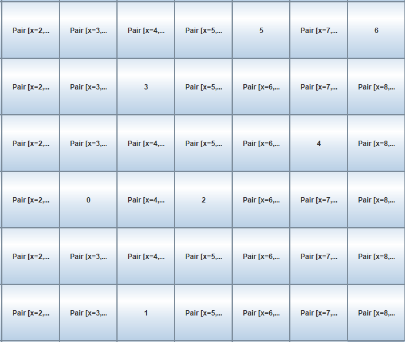

# Lab 03 - Application of LLM is Software Engineering.
## Legenda:
Per facilitare la lettura si userà la seguente nomenclatura per i vari LLMs affrontati: 
* GTP: ChatGPT 3.5
* C: Copilot
* CX: Codex

Quando viene riportata la domanda fatta da me nel prompt dei vari LLM questa viene evidenziata tramite una sezione apposita e appare nel seguente formato, per esempio:
> Che tempo fa oggi?

GPT: Bello. \
C: Brutto. \
CX: Nuvoloso.

## Task 1: CODE GENERATION
 
**Goal**: evaluate the effectiveness of various LLMs in generating solutions for OOP exam from previous years.
**Task**: utilize multiple LLMs (such as ChatGPT, GitHub Copilot, and Codex) to attempt solving past OOP exam questions. Assess which models deliver accurate solutions and document
any modifications you apply to enhance the models’ responses.
**Additional Task**: experiment with different prompting strategies (e.g., zero-shot, few-shot) to understand their impact on solutions

## Task 1: Implementazione.
Come caso d'uso ho voluto prendere la soluzione `a01a.e2` al seguente [repo](https://bitbucket.org/mviroli/workspace/repositories/) che ha la seguente specifica:
```txt
Scopo di questo esercizio è realizzare una GUI con l'aspetto mostrato nell'immagine fig1.png, fornita, 
che realizza la possibilità di selezionare un insieme di celle non contigue, per poi farle traslare
tutte insieme in alto-destra:
1 - l'utente clicka su una cella qualunque della griglia, e questa si numera incrementalmente
2 - può continuare a selezionare più celle, a patto che non ne selezioni una adiacente a una già numerata (fig 1)
3 - alla prima pressione su una cella *adiacente a una numerata* (orizzontale/verticale/diagonale), allora tutte le celle numerate si spostano in alto-destra di una posizione (fig 2)
4 - ad ogni altra successiva pressione di qualunque cella, tutte le celle numerate si spostano ulteriormente in alto-destra di una posizione (fig 3)
5 - non appena una pressione causerebbe l'uscita dalla griglia di una cella numerata (fig 3), a quel punto l'applicazione si chiuda

Sono considerati opzionali ai fini della possibilità di correggere l'esercizio, ma concorrono comunque 
al raggiungimento della totalità del punteggio:
- scorporamento via delegazione di tutti gli aspetti che non sono di view in una interfaccia+classe esterna
- gestione della fine del gioco
 
La classe GUI fornita, da modificare, include codice che potrebbe essere utile per la soluzione.

Indicazioni di punteggio:
- correttezza della parte obbligatoria: 10 punti
- qualità della parte opzionale: 5 punti
- correttezza della parte opzionale: 2 punti

```

Dunque, come primo passo ho fornito questo contesto ai vari LLM, altrimenti non avrebbero potuto rispondere alle domande in maniera sensata. Cosa si intende con contesto? Ciascuno di essi (in diversi modi) ha bisogno di conoscere la specifica intera del laboratorio e il codice delle classi implementate, che essa sia fornita tramite prompt per chi ne ha uno (come ChatGPT) o tramite qualsiasi altro mezzo, per esempio Copilot abilita un pulsante per visualizzare il contenuto delle classi prima di fargli una domanda.
> [!NOTE]  
> Poiché in ogni caso gli LLM capaci di tradurre in altre lingue effettuano internamente una conversione in inglese, per questioni di performance e riduzione di ambiguità delle parole si è scelto di scrivere direttamente in questa lingua.

A questo punto, la prima domanda basata su una tecnica "zero-shot": 

> Given the context I've provided you, can you implement every point?

GPT: [solution](src/MyTestLLM.java)

Ciò che sale subito all'occhio nella soluzione fornita è il fatto che GPT predilige sempre a unificare la soluzione ad un unico file evitando quelli che sono i buon principi di mantenimento del codice. Questo può essere ovviato chiedendo esplicitamente la suddivisione in classi. La soluzione fornita non è ottimale in quanto presenta diversi problemi evidenti:
1. La GUI non è come dovrebbe essere, infatti questo è l'aspetto che essa assume facendo eseguire il codice generato.
<p align="center">
  
</p>
3. Posso numerare infinite celle purché queste siano di distanza adeguata, ma quando ne numero una adiacente azzera quelle precedenti (simulando un Game Over) e inserisce uno zero nella nuova cella selezionata e le celle non si muovono mai perciò non rispetta interamente i requirements funzionali richiesti.
<p align="center">
  
  
</p>

GPT ignora totalmente nella richiesta ciò che si chiede in maniera opzionale, o gli si chiede di implementarlo oppure non lo considera.

C: [solution](src/MyTestCopilot.java) 

Implementare una soluzione in Copilot è stato molto più difficile rispetto GPT, siccome la dimensione del prompt e il numero di caratteri per effettuare le richieste è nettamente inferiore
La soluzione fornita da Copilot è peggiore rispetto a quella di ChatGPT. Questo oltre a riprendere le problematiche che GPT aveva inserito nella sua soluzione, ne ha pure aggiunte di nuove:
1. La GUI appare esattamente come fornita nella soluzione fornita da GPT.
2. Il funzionamento è migliorato perché prima i numeri si azzeravano senza nemmeno muoversi nella direzione corretta, anche se  adesso le celle a livello di GUI non vengono azzerate. Il GameOver non viene mai considerato, l'applicazione continua all'infinito.
<p align="center">
  
</p>

\

CX: 

